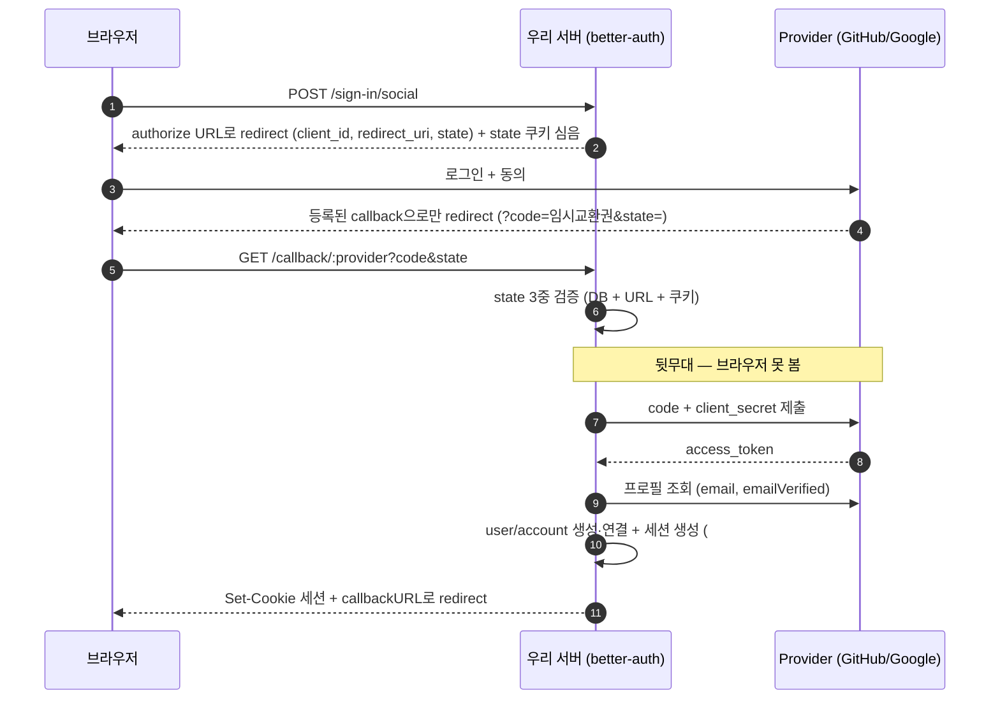

# Phase 2 — 인증 (better-auth)

## 슬라이스 배치

auth도 슬라이스: `features/auth/`에 betterAuth 인스턴스 + 설정 + hook을 응집 (핸들러 마운트만 `infra/`). org 스코프 격리 로직은 각 슬라이스가 아니라 공용 preHandler로 — "인증/테넌시는 슬라이스를 가로지르는 cross-cutting concern"을 직접 체감하는 페이즈.

## 작업 (스텝 순서대로)

1. **부트스트랩**: betterAuth 인스턴스 + drizzle adapter, Fastify 마운트, CLI로 스키마 생성 → user/session/account 테이블 확인
2. **email/password**: 가입→로그인→get-session→로그아웃 사이클, devtools에서 쿠키 속성(httpOnly/sameSite) 확인
3. **sliding session**: `expiresIn`/`updateAge` 짧게 설정해 갱신/만료 재현, session.expiresAt 갱신 시점 관찰 후 한 문단 정리
4. **RBAC**: admin plugin + `createAccessControl`, admin 전용 라우트 403/200 확인, `createUser`로 수동 발급
5. **계정 잠금**: `/sign-in/email` rate limit로 429 재현, `banUser`/`banExpires` 기간제 잠금 동작 확인
6. **계정 만료일**: `user.additionalFields.expiresAt` + before hook 거부 — built-in 없는 기능을 hook으로 확장하는 패턴 정리
7. **OAuth**: GitHub → Google, redirect 체인 네트워크 탭 추적, credential↔OAuth account linking 확인
8. **멀티테넌시**: organization plugin — 팀 생성/초대, 서버 리소스를 org 스코프로 격리, 다른 org 데이터 접근 시 404/403
9. **테스트**: 내가 쓴 코드만 — 계정 만료 before hook·잠금 판정 로직 unit 테스트, 가입→로그인→보호 라우트 접근 integration 테스트, org 격리 integration 테스트(다른 org 리소스 404/403). better-auth 내부 동작은 테스트하지 않음

## 완료 기준

- 위 9개 스텝 전부, 테스트는 CI에서 통과

## 구현 전 던져야 할 질문

1. 세션 기반 vs JWT 기반 인증 — 트레이드오프는? better-auth는 왜 세션 기본인가?
2. 세션 쿠키의 httpOnly / secure / sameSite 각각 무슨 공격을 막나? sameSite=lax와 strict의 실사용 차이는?
3. `expiresIn`과 `updateAge`의 정확한 관계는? updateAge가 0이면/expiresIn과 같으면 각각 무슨 일이 생기나?
4. 패스워드 해싱에서 bcrypt/scrypt/argon2 차이는? "느린 해시"가 왜 필요한가?
5. rate limit과 account lockout은 뭐가 다른가? lockout이 오히려 공격 도구(고의 잠금 DoS)가 되는 시나리오는?
6. OAuth authorization code flow를 단계별로 그릴 수 있나? `state` 파라미터는 무슨 공격을 막나? PKCE는 언제 필요한가?
7. account linking에서 "이메일이 같으면 자동 연결"이 위험해지는 조건은? (provider의 이메일 검증 여부)
8. RBAC의 한계는? 어떤 요구사항이 오면 ABAC로 넘어가야 하나?
9. 멀티테넌시에서 org 격리를 미들웨어에서 할 때와 쿼리(WHERE)에서 할 때 각각 뭘 놓칠 수 있나?
10. 외부 라이브러리가 대부분을 소유한 기능에서 "내 코드"의 테스트 경계는 어디인가? 라이브러리 내부 동작까지 테스트하면 뭐가 문제인가?

## 이해도 체크 (퀴즈)

```
Phase 2(better-auth 인증) 학습 끝났어. 아래 주제로 퀴즈 7~10문제 내줘.
개념 설명형 + 시나리오형 + "이 설정이면 무슨 일이 생기나" 예측형을 섞어서,
한 문제씩 내고 내 답을 채점 + 보충 설명해줘. 다 끝나면 취약 주제 정리해줘.

주제: 세션 vs JWT, 쿠키 보안 속성과 대응 공격(XSS/CSRF), sliding session 메커니즘,
패스워드 해싱, rate limit vs lockout과 잠금 DoS, OAuth code flow와 state/PKCE,
account linking 위험, RBAC 설계와 한계, org 단위 데이터 격리,
인증 기능의 테스트 경계(내 코드 vs 라이브러리)
```

7할 미만이면 재학습 후 다음 페이즈. 인증은 특히 — 애매하게 아는 상태로 넘어가지 말 것.

## 학습 로그

<!-- 배운 것 / 막혔던 것 / 퀴즈 결과 -->

### 2026-07-22 — auth 부트스트랩 (#55)

**Q1 답 — 세션 vs JWT:**

- 세션 = "서버가 기억"이라 취소가 쉽고, JWT = "클라이언트가 증명"이라 취소가 안 된다. 인증 라이브러리의 기능 대부분(로그아웃, ban, 기기별 세션 해제, sliding session, org 전환)은 **취소하거나 바꾸는 기능** — 서버 상태 없이는 성립 안 함. better-auth가 세션 기본인 이유
- JWT로 revoke를 풀려면 블랙리스트 = 상태를 다시 들이게 됨 — 세션 비용은 그대로 내면서 즉시성만 잃은 구조
- "세션은 확장 안 됨"은 메모리 세션 시절 오해 — DB 세션이면 앱 서버는 무상태라 수평 확장 문제없음. 조회 병목은 cookie cache(단기 서명 쿠키로 DB 조회 생략) / secondaryStorage(Redis)로 완화. 인스타급도 패턴은 쿠키 세션 — 그 규모에선 라이브러리가 아니라 저장소를 갈아끼움
- 현대의 정리: 승부가 아니라 **배치 문제** — 신뢰 경계 안(브라우저↔자사 백엔드)은 세션, 경계를 넘을 때(OIDC, 서비스 간)는 JWT, JWT 수명은 항상 짧게. 실무는 하이브리드로 수렴: 취소 가능한 앵커(refresh token/세션) + 짧은 무상태 증명(access token/cookie cache)

**배운 것 / 막혔던 것:**

- better-auth 인스턴스는 db가 필요 → 앱은 `createAuth(fastify.db)` 팩토리로 주입, CLI는 env에서 자기 db를 만드는 `auth.config.ts` 사용 — drizzle-kit과 drizzle.config.ts의 관계와 동일한 구조. **앱 코드는 auth.config를 절대 import 안 함** (커넥션 이중화 + cwd 의존 유입)
- 생성 체인: `auth:generate`(설정→schema TS) → `db:generate`(TS→SQL) → `db:migrate`(적용). 역할이 달라 대체 불가. 클론 후 셋업은 migrate만 — generate 산출물은 전부 커밋되므로. "산출물은 손대지 않고 원본을 고친다"가 한 층 위에서 반복됨 (auth.schema.ts의 원본은 auth.ts 설정)
- CLI 기본 산출물명 `auth-schema.ts`는 drizzle glob(`*.schema.ts`)에 **매칭 안 됨** — 에러 없이 무시되는 조용한 함정. `--output`으로 강제
- `process.loadEnvFile` 상대경로는 파일 위치가 아니라 cwd 기준 — package.json script로 감싸 cwd를 고정하는 게 이 레포 컨벤션 (drizzle.config.ts와 동일)
- Fastify 마운트: better-auth handler는 Web Request/Response — 변환 시 **응답 헤더 복사(특히 set-cookie)를 빠뜨리면** 로그인해도 세션 쿠키가 클라이언트에 영영 안 감. 원인 모를 인증 실패의 씨앗
- `tsx watch`는 감시자+서버 2프로세스 — 패턴 kill로 부모만 죽이면 자식이 좀비로 포트 점유. 정리는 포트 기준(`lsof -ti :3000 | xargs kill`)

### 2026-07-22 — email/password 사이클 (#56)

**관찰 기록:**

- 가입→로그인→get-session→로그아웃 사이클 curl로 재현. 세션 쿠키:
  `better-auth.session_token=토큰.서명; Max-Age=604800; Path=/; HttpOnly; SameSite=Lax`
  — `Secure` 없음은 baseURL이 http라서 (배포 시 https면 붙음). 쿠키 값이 `토큰.서명` 2부 구조 — 서명 검증이 DB 조회 전에 위조를 걸러줌
- account.password는 `salt:hash` (scrypt) — 평문 없음 확인

**Q2 답 — 쿠키 속성과 대응 공격:**

- `httpOnly` → XSS: 스크립트가 쿠키를 못 읽음. **XSS = 훔쳐서 쓴다**
- `secure` → 평문 HTTP 전송 차단 (중간자 도청)
- `sameSite` → CSRF: 쿠키는 안 훔쳐짐 — 공격 사이트가 우리 서버로 요청을 날리면 브라우저가 쿠키를 자동 첨부하는 게 문제. **CSRF = 못 보지만 시킨다.** XSS와 방어 축이 다름
- lax vs strict: lax는 최상위 GET 네비게이션(외부 링크 클릭 진입)에 쿠키 허용 — 링크 타고 와도 로그인 유지. strict는 그것도 차단 — 외부 진입 시 로그아웃처럼 보임. POST/fetch류 cross-site는 lax도 차단하므로 CSRF 방어는 유지 → lax가 기본값인 이유

**Q4 답 — 느린 해시:**

- salt = 사전계산(레인보우 테이블) 무효화, 같은 비번도 다른 해시
- 느림 = DB 유출 후 오프라인 브루트포스 단가 상승 — sha256은 GPU 초당 수십억 회, scrypt는 메모리+연산 강제로 초당 수천 회. **salt는 "미리 계산 못 하게", 느림은 "지금 계산도 비싸게"** — 역할이 달라 둘 다 필요

**막혔던 것:**

- sign-up 500: `drizzleAdapter(db, { provider: "pg" })`에 **schema 미전달** — 우리 drizzle 클라이언트는 schema 없이 생성되므로 adapter가 user 모델을 못 찾음. `schema: authSchema` 명시로 해결. auth 슬라이스가 자기 스키마를 자기 adapter에 주입하는 게 의존 방향도 맞음 (infra가 슬라이스 스키마를 알면 역전)
- better-auth는 라우터 내장 — 캐치올 하나가 전부 커버, plugin이 라우트도 추가함. 단 우리 zod provider를 안 거치니 /docs에 안 나옴. 내부 호출용 `auth.api.*`가 따로 있음 (org preHandler에서 쓸 것)

### 2026-07-22 — sliding session (#57)

**관찰 (expiresIn: 30s / updateAge: 10s로 실험 후 원복):**

- updateAge 경과 전 get-session → expiresAt **그대로**, 경과 후 요청 → **지금+expiresIn으로 연장**. 갱신 트리거는 시간이 아니라 **요청** — 계속 쓰면 안 죽고, 방치하면 죽는 게 sliding의 정체
- expiresIn 경과 후 → get-session null (만료)

**Q3 답 — expiresIn과 updateAge의 관계:**

- expiresIn = 세션 수명, updateAge = 그 수명을 미는 행위의 **빈도 제한(스로틀)**. `updateAge < expiresIn`이어야 sliding 성립
- `updateAge: 0` → 매 요청 갱신 = 요청당 session 테이블 UPDATE — 읽기 경로에 쓰기가 끼어드는 오버헤드. cookie cache가 이 비용을 건너뛰는 장치
- `updateAge === expiresIn` → 갱신 자격이 생기는 순간이 곧 만료 순간 — sliding 소멸, **절대 만료**로 동작
- 실험 설정은 코드에 안 남김 — 기본값(7일/1일) 복귀, 지식은 로그가 소유

### 2026-07-23 — RBAC (#58)

**Q8 답 — RBAC의 한계와 ABAC:**

- RBAC 판정은 `allow(역할, 행위)` — **리소스가 인자에 없음.** "자기가 만든 서버만 삭제", "같은 org만 조회"처럼 주체↔리소스의 **관계**가 조건이 되는 순간 role로 표현 불가. ABAC은 `allow(주체 속성, 리소스 속성, 컨텍스트)`
- 넘어갈 신호: 역할 조합 폭발 — 속성을 role 이름에 인코딩("org-A-admin"...)하기 시작하면 늦은 것
- 실무 배치: 굵은 문지기는 RBAC(requireAdmin preHandler), 관계 규칙은 쿼리/서비스 레벨 속성 검사 — #62 org 격리가 사실상 ABAC

**배운 것 / 막혔던 것:**

- admin plugin 추가 → auth:generate 체인 첫 재실행. 0002: user에 role/banned/ban_reason/ban_expires, session에 impersonated_by — plugin이 스키마도 라우트도 늘림
- **첫 admin 부트스트랩 문제**: admin 만드는 API는 admin 권한 필요 — 닭-달걀. 첫 발급은 시스템 밖(SQL/seed)에서, 이후는 API(`admin/create-user`)로
- 가드를 `/api/auth/*` 캐치올에 붙이는 실수 — 로그인 라우트에 admin 가드가 걸려 데드락 (로그인하려면 세션 필요 ← 세션엔 로그인 필요). 가드는 보호 대상 라우트에만
- `auth.api.*` 서버 내부 호출도 **headers를 넘겨야 함** — 요청자 신원을 쿠키로 판단. 우리 가드(규격 에러로 조기 차단) + better-auth 내부 검사(우회 불가 최종선)의 이중 구조
- better-auth의 Origin 검사 = sameSite에 더한 CSRF 이중 방어. curl은 Origin을 안 보내 거부됨 → `-H 'origin: ...'`으로 통과. **위조 걱정의 답**: 공격 성립엔 "쿠키 + Origin 위조" 동시 필요한데, 브라우저(쿠키 자동 첨부)는 Origin을 거짓말 못 하고, curl(Origin 위조 자유)은 피해자 쿠키를 가질 방법이 없음 — 두 능력이 배타적
- `Auth` base 타입엔 role이 없음 — plugin 타입 확장은 인스턴스 추론 경유라 `ReturnType<typeof createAuth>` 사용
- 헤더 변환 헬퍼 2번째 사용처 발생 → 승격. 단 utils/ 신설은 ADR-0008 위반(제2의 쓰레기장) — 사용처가 전부 auth라 `features/auth/auth.headers.ts`로. infra 승격은 타 슬라이스가 쓸 때
- 가드 integration 테스트(401/403/200)는 #63에서 org 격리 테스트와 함께

### 2026-07-27 — rate limit + 계정 잠금 (#59)

**Q5 답 — rate limit vs lockout, 잠금 DoS:**

- rate limit = **요청자(IP) 기준**, 성공/실패 무관하게 요청 횟수 자체를 셈 → 429, 창 지나면 자동 해제. lockout = **계정 기준**, 실패 횟수를 셈 → 계정 잠금. 공격자가 IP를 분산하면 rate limit은 뚫려도 lockout은 잡음 — 세는 축이 달라 상호 보완
- 잠금 DoS: 계정 기준이라는 점이 역으로 무기가 됨 — 피해자 이메일로 고의 실패 반복 → 정당한 주인이 못 들어옴. 그래서 실무는 영구 잠금 대신 **기간제 잠금 + CAPTCHA + 본인 알림** 조합
- better-auth의 "브루트포스 방어 2종"의 실체: rate limit은 자동, ban은 **관리자 수동 조치**. "실패 N회 → 자동 잠금"은 built-in 없음 — 필요하면 hook으로 직접 (스텝 6의 확장 패턴)

**관찰:**

- rate limit은 dev에서 기본 비활성 — `rateLimit: { enabled: true }` 한 줄이 전부. `/sign-in*`·`/sign-up*`·`/change-password*` 등엔 **내장 특수 규칙 10초/3회**(reset류는 60초/3회)가 이미 있어 customRules 불필요
- 재현: 로그인 3회 401 → 4회째 `429` + `X-Retry-After: 10`, 창 경과 후 다시 받아줌. 카운터는 실패든 성공이든 요청 수 기준
- 저장소 기본 memory — 멀티 인스턴스면 인스턴스별 카운터가 따로 놀아 `database`/`secondary-storage`(Redis)로 바꿔야 함
- ban: `admin/ban-user`에 `banExpiresIn`(초) → `ban_expires` 기록. ban 상태 로그인은 **비번이 맞아도** `403 BANNED_USER`. 만료 후 로그인 200 — `banned` 플래그는 스케줄러가 아니라 **만료 후 접근 시점에 lazy clear** (DB만 보면 아직 banned=t여도 이미 풀린 상태일 수 있음)
- 429는 IP가 주체라 메시지가 익명이고, 403 BANNED_USER는 계정이 주체라 메시지가 계정에 귀속 — 응답만 봐도 두 방어의 축 차이가 드러남

### 2026-07-27 — 계정 만료일 (#60)

**라이브러리 확장 패턴:**

- built-in 없는 기능 = **additionalFields(스키마 확장) + hook(동작 확장)** 조합. 스키마만 늘리면 데이터일 뿐, hook이 붙어야 동작이 됨
- hook은 2계층: `hooks.before/after`(HTTP 요청, 경로 기준) vs `databaseHooks`(데이터 모델 생명주기). 만료 거부는 `databaseHooks.session.create.before` 선택 — **비번 검증 통과 후** 실행이라 계정 존재가 안 새고, "만료 계정은 세션을 못 갖는다"가 본질이라 로그인 수단이 늘어도(OAuth) 자동 커버
- `input: false` — 가입 body에 expiresAt 넣어도 무시(mass assignment 방지). 만료일 최초 설정은 ban 때처럼 시스템 밖(SQL)/관리자 경로만
- 판정은 `auth.expiry.ts`의 순수 함수 `isAccountExpired(expiresAt, now)`로 분리 — null=무기한 규칙이 한 곳에 응집, #63에서 DB 없이 unit 테스트

**막혔던 것:**

- hook에서 `AppError`(RFC 9457) 던지면 안 됨 — hook은 better-auth handler **내부**에서 실행되고 예외도 거기서 잡힘. 모르는 타입이면 500. `APIError` 던져야 403+code로 변환. 에러 규격은 2개 공존: `/api/auth/*`는 better-auth 규격, 나머지가 RFC 9457 — **확장 코드는 호스트 라이브러리의 에러 규약을 따른다**
- 닭-달걀 타입 문제 재방문: additionalFields 타입은 인스턴스 추론(`ReturnType`) 경유인데 hook은 그 인스턴스를 만드는 설정 객체 안 → `internalAdapter` 반환이 base User라 `expiresAt` 없음(TS2339). 해결: 같은 설정에서 생성된 `auth.schema.ts`의 `$inferSelect`로 타입 파생 캐스트 — 필드 추가 시 generate 체인만 돌리면 타입 자동 갱신. 손캐스트 아닌 single source 파생 ("산출물 아닌 원본"의 타입 버전)
- curl 3케이스(과거→403 ACCOUNT_EXPIRED, 미래→200, NULL→200)는 통과했는데 타입은 깨져 있었음 — **런타임 검증만으론 CI 실패를 못 잡음**, `tsc --noEmit`이 로컬 루틴에 필요

### 2026-07-27 — OAuth (GitHub → Google) + account linking (#61)

**Q6 답 — authorization code flow:**



- 구조 = **앞무대/뒷무대 분리**: 브라우저 경유 구간엔 공개 id와 단명 교환권(code)만, 진짜 값(client_secret, access_token)은 서버↔provider 직통에만. flow가 꼬여 보이는 이유 전부가 이 분리
- 등록 3요소: 신원 만들기(OAuth App 등록) / 신원 표시·증명(client_id 공개, client_secret 비밀) / **code 배달지 잠금**(callback URL 화이트리스트 — redirect_uri 바꿔치기로 code 탈취 방어)
- **state** = "flow를 시작한 브라우저 == callback으로 돌아온 브라우저" 를 쿠키로 묶는 끈. 막는 공격은 login CSRF — 공격자가 **자기 code**가 담긴 callback URL을 피해자에게 열게 해서 피해자 브라우저에 공격자 세션을 심는 것(이후 피해자가 저장하는 데이터를 공격자가 열람). callback 화이트리스트(내 code 도둑맞기)와 방어 방향이 반대
- **PKCE** = client_secret을 가질 수 없는 클라이언트(모바일/백엔드 없는 SPA)용 일회용 즉석 secret. verifier 해시를 먼저 보내고 교환 때 원본 제출 — "시작한 놈 == 교환하는 놈" 증명

**Q7 답 + linking 관찰:**

- account 테이블이 provider 개념의 실체: user 1—N account, credential(비번)도 provider의 하나
- GitHub 로그인 후 Google 로그인 → user 행 그대로, account 행만 추가 = **자동 linking**. 판정은 "이메일 일치 + provider가 그 이메일을 검증했는가"
- 반대 방향 실험: 같은 이메일로 **비번 가입** 시도 → 422 USER_ALREADY_EXISTS. 비번 가입은 이메일 소유 증명이 없어서 — 자동 연결하면 이메일만 아는 아무나 계정 탈취(Q7의 위험 조건). **같은 "이메일 일치"라도 누가 검증했느냐로 연결/거부가 갈림.** OAuth user에 비번을 정당하게 붙이는 길은 세션 후 setPassword / 비번 재설정 — 둘 다 "소유 증명 후"
- 검증 안 하는 provider의 이메일을 믿고 자동 연결하는 게 Q7의 사고 시나리오 — better-auth가 emailVerified 기반 + trustedProviders 옵션으로 통제하는 이유

**막혔던 것 (전부 보안장치가 정상 작동한 것):**

- **state_mismatch**: curl로 authorize URL 받아 브라우저에 붙여넣음 → sign-in/social 응답의 state **쿠키를 curl이 먹고 버림** → callback 브라우저에 쿠키 없음 → 거부. "URL 넘겨받아 여는" 행위가 구조적으로 login CSRF 공격과 구별 불가라 죽는 게 맞음. flow는 한 브라우저 안에서 시작·종료해야 함
- **email_not_found**: GitHub **App**을 만들었음(OAuth App 아님). GitHub App은 scope 파라미터 무시하고 등록된 permission을 따르는데 기본 email 권한 없음 → 프로필 email null(private 설정) + /user/emails fallback도 거부. OAuth App으로 재등록해 해결
- 로그인 성공 후 404: callbackURL "/"에 라우트 없음 — 에러 응답이 RFC 9457 규격 = better-auth 세계를 **벗어난 뒤**의 404라는 증거 (#60의 "에러 규격 2개 공존" 실물)

### 2026-08-10 — 멀티테넌시: organization plugin + org 스코프 격리 (#62)

**Q9 답 — 미들웨어 격리 vs 쿼리 격리, 각각의 사각지대:**

- 두 층은 아는 것이 다름: 미들웨어는 세션("누가, 어느 org")만 알고 row의 소속은 모름. 쿼리는 row는 아는데 요청자를 스스로 확정 못 함
- **미들웨어만**: `GET /servers/:id`에서 id가 남의 org 것인지 판단 불가(그 정보는 DB에) → IDOR 그대로. 목록은 row를 본 적이 없어 필터 불가. — 실제로 스텝 5까지만 하고 6을 빼먹은 중간 상태가 정확히 이 모습이었음: preHandler 통과 후 남의 server가 200으로 나옴
- **쿼리만**: WHERE에 넣을 orgId를 만들어줄 층이 없음 → 핸들러마다 세션 파싱 복붙, 하나 빠지면 누수. 비로그인이 401 대신 빈 200/이상한 500으로 새어나감. 인가 실패의 단일 통제 지점 없음
- 분업: **preHandler = "누가"를 확정해 신뢰 가능한 orgId를 request에 주입(401/403), WHERE = 그 orgId로 row 격리(мис스 → 404)**

**구현 — cross-cutting concern의 배치:**

- auth 인스턴스가 authRoute 안에 갇혀 있어 타 슬라이스가 못 씀 → `auth.plugin.ts`(fastify-plugin)로 `fastify.auth` 승격. fp 없이는 형제 플러그인에 decorator 안 보임(캡슐화) — `fastify.db`와 같은 패턴. 인스턴스 2개 상태로 두면 "가드의 auth ≠ 핸들러의 auth" 미궁 버그 씨앗
- 격리 로직은 `requireOrg` 가드 하나(auth 슬라이스), servers 슬라이스에 남는 건 `addHook("preHandler", requireOrg(fastify.auth))` **한 줄** — "복붙 금지" 완료조건의 실현 방식
- repository는 전 함수가 orgId를 받아 `and(eq(id), eq(organizationId))`. create는 orgId를 서버가 주입 — 클라이언트가 org를 지정하는 순간 격리가 아님
- **404 vs 403**: 남의 org row에 403을 주면 "그 id 존재함"이 샘. WHERE로 거르면 기존 SERVER_NOT_FOUND 404가 그대로 재사용되며 존재 자체를 은폐. 삼분: 401(신원 없음)/403(org 미선택)/404(내 org에 그런 row 없음)
- "org 소속"(member)과 "**활동 중** org"(session.activeOrganizationId)는 별개 — 멀티 org 유저 때문. set-active는 세션에 붙는 상태라 새 로그인엔 없음 → NO_ACTIVE_ORG 403으로 재현됨
- 응답의 organizationId는 zod response 스키마에 없어서 serializer가 걸러줌 — 스키마 기반 직렬화의 부수 효과(허용 목록 방식)

**막혔던 것:**

- 기존 servers 테스트 전멸: FK 때문에 부모(organization) 행 없이 insert 불가 → beforeAll에 org 픽스처. **FK를 넣는 순간 자식 테이블 테스트는 부모 픽스처를 요구** — 격리 비용이 테스트에 전가됨. #63의 org 2개 격리 테스트 밑작업
- swagger에 auth/* 안 보이는 이유 재확인: 캐치올 한 줄 + 스키마 없음, 라우팅은 better-auth 내장 라우터 몫. 필요하면 openAPI plugin이 /api/auth/reference 자체 서빙
- orgId/ordId 오타 혼재 — 위치 기반 전달이라 동작은 했음. 이름이 반씩 다른 코드는 미래의 나를 속임

### 2026-08-10 — Phase 2 이해도 퀴즈 (#64)

**결과: 9문제 약 60% — 기준(7할) 미달. 재퀴즈 없이 진행하기로 결정 (본인 판단).**

- 강함: OAuth state(재강의 후 재구성 성공), RBAC 한계, 테스트 경계("그 분기를 우리가 작성했나"), org 격리 구현
- 약점 (다음 복습 대상):
  - sliding session — "만료시각은 활동에 따라 미끄러지는 값, updateAge는 스로틀" 모델 부재
  - 쿠키 속성 — 공격 실행 위치 모델 (XSS=우리 origin 안 브라우저, HttpOnly 있어도 "못 봐도 안에서 시킨다")
  - 해싱 기초 — salt=사전계산·재사용 몰수(비밀 아님), 느림=대입 단가, "역산 불가 ≠ 대입 불가"
  - 세션 vs JWT — 원리는 아나 우리 기능(ban/sliding/set-active = 전부 취소·변경 기능)과 연결 안 됨
  - 401/403/404 삼분 — 남의 org 리소스는 403이 아니라 404 (존재 은폐). 직접 재현하고도 틀림
- 패턴: 손으로 한 건 다 됐는데 인출이 안 됨 — 관찰만 하고 지나간 주제일수록 심함. 로그 재독 필요
